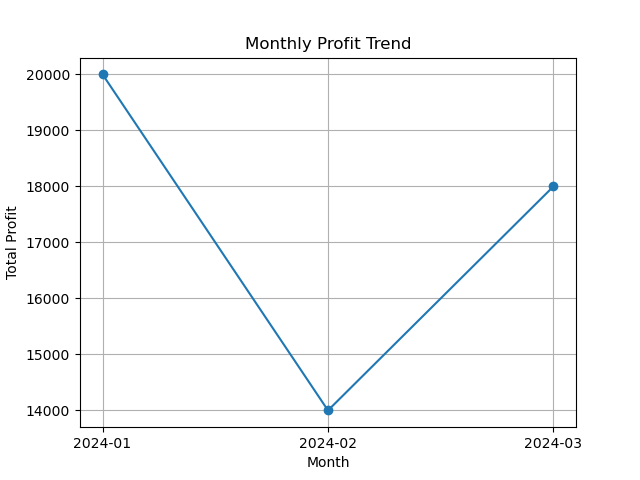
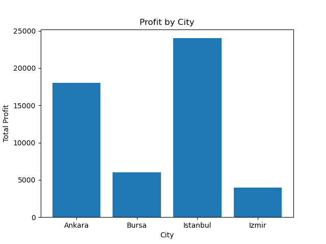
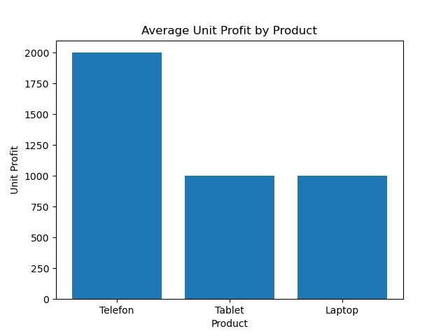

# 📊 Sales Performance Analysis with SQL & Python

## 🎯 Project Objective
This project analyzes sales data over time to understand profit trends, city performance, and product-based profitability.

## 🧩 Dataset
The dataset includes:
- Date (month)
- Product
- City
- Quantity
- Selling price
- Cost price

## ⚙️ Analysis Performed

### SQL Analysis
- Monthly total profit
- Most profitable month
- Profit by city and month
- Best city-month combination

## 📈 Key Insights
- January is the most profitable month.
- Profit decreased in February and increased again in March.
- Istanbul generated the highest profit in March.

## 🛠️ Tools Used
- Python (Pandas)
- SQLite
- SQL# sales-performance-analysis
Sales analysis project using SQL and Python

## 📊 Visualizations

### Monthly Profit Trend

### Profit by City

### Product Profitability

